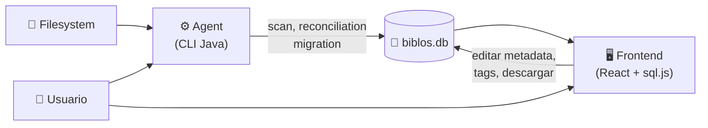

# Biblos — Agent Instructions

Biblios es un sistema de respaldo catalogación de biblioteca personal digital. Permite catalogar y gestionar archivos
PDF, EPUB y MHTML almacenados en el sistema de archivos local. El sistema **no almacena los archivos** — solo guarda
metadatos y referencias al filesystem.

Cuando se acumulan cientos o miles de documentos digitales en una carpeta, encontrar un archivo específico o mantener un
inventario de lo que se tiene se vuelve difícil. BiblioCat resuelve esto detectando los archivos en el
directorio de biblioteca, infiriendo autores desde la estructura de carpetas, y permitiendo búsqueda por metadatos
(nombre, autor, etiquetas, formato, año). Además, ante una pérdida accidental de archivos, el catálogo preserva los
metadatos como "póliza de seguro".

El sistema no es de uso personal del desarrollador, intenta ser un público para cualquier usuario.

BiblioCat **no** es:

- Un gestor de descargas — no descarga archivos de URLs
- Un lector de PDF, EPUB o MHTML — no abre ni renderiza archivos
- Un motor de búsqueda de texto completo — solo busca por metadatos
- Un sistema que almacena o modifica los archivos originales — solo los referencia

**Plataforma objetivo:** Windows (10/11). El sistema está diseñado y probado exclusivamente para el ecosistema Windows.

**Qué puede hacer el usuario:**

*Cargar datos:*

- Subir el archivo .db del catálogo desde su dispositivo
- Seleccionar el archivo .db desde el disco (navegadores Chromium)

*Explorar el catálogo:*

- Navegar por sources, autores y tags
- Buscar sources por nombre o autor
- Filtrar por formato (PDF, EPUB, MHTML)
- Filtrar por tag específico
- Filtrar por autor
- Ordenar la tabla de sources por diferentes columnas
- Ver el detalle completo de un source

*Modificar el catálogo:*

- Editar metadata de un source (año, edición, URL)
- Asignar tags a un source
- Quitar tags de un source
- Crear nuevos tags
- Renombrar tags existentes
- Eliminar tags (se desasocia de todos los sources)

*Guardar cambios:*

- Guardar los cambios descargando la base de datos modificada
- Exportar el catálogo como archivo JSON

*Mantenimiento del filesystem:*

- Escanear el directorio de biblioteca
- Detectar y catalogar archivos PDF, EPUB y MHTML
- Detectar cambios en archivos (renames, eliminaciones)
- Crear backups automáticos antes de sincronizar
- Migrar la estructura de la base de datos

**Qué no puede hacer el usuario:**

*No puede modificar la estructura del catálogo:*

- No puede crear autores (son inferidos por el agente desde carpetas)
- No puede editar autores (requiere renombrar carpetas en el filesystem)
- No puede modificar el nombre o path de un source (pertenecen al filesystem)
- No puede modificar la estructura de la base de datos

*No puede acceder al contenido de archivos:*

- No puede abrir ni visualizar archivos PDF, EPUB o MHTML
- No puede descargar archivos originales del catálogo
- No puede buscar dentro del contenido de los archivos

*No puede usar el agente desde el frontend:*

- No puede ejecutar el escaneo del directorio
- No puede ejecutar la sincronización con el filesystem
- No puede ejecutar migraciones de la base de datos

*No puede usar en otras plataformas:*

- No puede funcionar en macOS o Linux (exclusivamente Windows)
- No puede sincronizar datos entre dispositivos
- No puede acceder a archivos en la nube
- No puede procesar archivos de otros formatos

---

## 1. Glosario

| Término         | Definición                                                                                                                                                                                                    |
|-----------------|---------------------------------------------------------------------------------------------------------------------------------------------------------------------------------------------------------------|
| Source          | Archivo PDF, EPUB o MHTML descubierto en el directorio de biblioteca y representado como registro en la base de datos.                                                                                        |
| Tag             | Etiqueta asignada por el usuario para categorizar sources. Relación muchos a muchos con sources.                                                                                                              |
| Source format   | Discriminante de tipo de archivo soportado para una source: PDF, EPUB o MHTML.                                                                                                                                |
| Filesystem (FS) | Directorio local que contiene los archivos de biblioteca. Es la fuente de verdad del sistema.                                                                                                                 |
| Database (DB)   | Archivo SQLite donde se almacena la información de la biblioteca.                                                                                                                                             |
| Content hash    | Hash SHA-256 del contenido del archivo. Usado para detectar renombres y safe-save.                                                                                                                            |
| Orphan source   | Source cuyo archivo fue eliminado del FS pero cuyo registro de metadatos persiste en la base de datos (soft-delete). Puede ser reactivada si el archivo reaparece en el FS.                                   |
| Metadata        | Información asociada a un source en la base de datos: nombre, path, formato, año, edición, URL, autor, tags, content hash y timestamps. Se preserva durante el soft-delete y se transfiere en caso de rename. |
| Agent           | Aplicación Java que escanea el directorio y sincroniza las fuentes del FS con las de la base de datos.                                                                                                        |
| Frontend        | Aplicación web que provee la interfaz de usuario para navegar y gestionar el catálogo de la base de datos.                                                                                                    |
| Scan            | Proceso que realiza el agent donde recorre un directorio del FS, detecta archivos de biblioteca compatibles y computa sus hashes.                                                                             |
| Foundation      | Proceso donde se crea la base de datos a partir de las sources que produjo es scan. A diferencia de la reconciliation, este no compara una base de datos ya existente.                                        |
| Reconciliation  | Proceso de sincronización entre el estado actual del FS y los registros en la base de datos.                                                                                                                  |
| Migration       | Proceso de donde se actualiza estructuralmente la DB. Sucede automáticamente durante una reconciliation o, puede ejecutarse manualmente. Solo permitido si la versión del agent es >= a la de DB.             |
| Backup          | Copia de seguridad del archivo .db que se crea automáticamente antes de aplicar cambios durante una reconciliation para proteger los datos ya existentes.                                                     |
| Soft delete     | Marcado de un registro como eliminado (se establece `deleted_at`) sin borrarlo físicamente. Los metadatos se preservan hasta que el usuario los borra desde el frontend.                                      |

## 2. Módulos

Monorepo. Dos módulos independientes, sin sistema compartido de build. Cada uno tiene su propia toolchain.

| Módulo   | Ruta        | Responsabilidades                                                                                                                                                          |
|----------|-------------|----------------------------------------------------------------------------------------------------------------------------------------------------------------------------|
| Agent    | `agent/`    | Sincronizar la base de datos con con el FS. Computar SHA-256 de archivos. Inferir autores desde la estructura de carpetas. Ejecutar migraciones Flyway si la hubiere.      |
| Frontend | `frontend/` | Mostrar el catálogo al usuario. Permitir búsqueda, filtros y edición de metadatos. Gestionar tags (CRUD y asignación). Modificar archivos de base de datos y descargarlos. |

### Diagrama de comunicación entre Agent y Frontend



## Source of truth

Detailed specs live in `docs/` — these define the intended architecture, not the current code:

- `docs/agent.md` — agent module spec (filesystem scanner, SQLite, CLI pipeline)
- `docs/front.md` — frontend spec (structural CSS, sql.js, hash routing)

Consult these before implementing features in either module.

## Commands

### Agent module (run from `agent/`)

```
mvnw clean compile            # build
mvnw test                     # tests (JUnit — pom.xml has JUnit 3.8.1 placeholder)
mvnw package jpackage:jpackage # build distributable app-image (JDK 21 + jpackage)
```

### Frontend module (run from `frontend/`)

```
npm run dev           # dev server (Vite)
npm run build         # tsc -b && vite build
npm run lint          # oxlint (NOT eslint)
npx tsc --noEmit      # typecheck only
```

OpenCode slash commands also available: `/agent-build`, `/agent-test`, `/agent-package`, `/front-build`, `/front-dev`, `/front-lint`,
`/front-typecheck`.

## Conventions

- **No shared root build** — there is no root `package.json` or monorepo tool. Modules are independent.
- **Frontend CSS** — structural-only (no colors, gradients, fonts, transforms). See `docs/front.md` for philosophy.
- **TypeScript strictness** — `erasableSyntaxOnly`, `verbatimModuleSyntax` are enabled. No enums.
- **Linter** — frontend uses Oxlint, not ESLint. Config at `frontend/.oxlintrc.json`.
- **Commit style** — Conventional Commits format. Use `/commit` command for guided flow.
- **Agent is placeholder** — `agent/src/main/java/com/biblos/App.java` is "Hello World". Real implementation follows
  `docs/agent.md`.
- **Frontend is boilerplate** — default Vite React template. Real implementation follows `docs/front.md`.

## Current state

Still defining the documentation. Both modules are scaffolds. Implementation will not start until the documentation is
completely defined.
