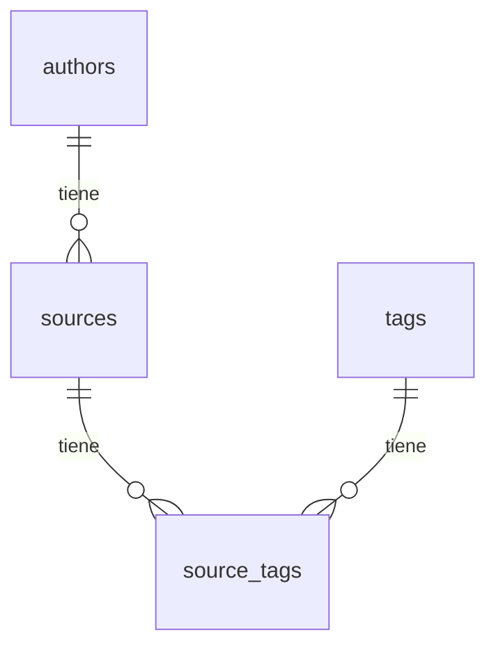

# 1. Stack detallado de tecnologías y dependencias

## 1.1. Lenguaje y build

| Capa          | Tecnología  | Versión | Notas                                         |
|---------------|-------------|---------|-----------------------------------------------|
| Lenguaje      | Java        | 21      | LTS                                           |
| Build         | Maven       | —       | Wrapper en `agent/mvnw`                       |
| Base de datos | SQLite      | —       | Archivo `.db` portátil                        |
| Acceso a BD   | JDBI        | 3.54.0  | Capa sobre JDBC para SQLite                   |
| SQLite JDBC   | sqlite-jdbc | 3.46    | Driver JDBC para SQLite, 0 dependencias extra |
| Logging       | Log4j 2     | 2.23.1  | API directa (`log4j-api` + `log4j-core`)      |

## 1.2. APIs del JDK utilizadas

| Paquete JDK     | Clases principales                            | Propósito                                        |
|-----------------|-----------------------------------------------|--------------------------------------------------|
| `java.nio.file` | `Path`, `Paths`, `Files`, `SimpleFileVisitor` | Escaneo de directorios, operaciones con archivos |
| `java.security` | `MessageDigest`, `DigestInputStream`          | Cálculo de hash SHA-256                          |
| `java.sql`      | `Connection`, `Statement`, `ResultSet`        | Conexión a SQLite via JDBI                       |
| `java.io`       | `IOException`, `InputStream`                  | E/S básica y manejo de errores                   |
| `java.util`     | `List`, `Map`, `Set`, `Properties`            | Colecciones, configuración y utilidades          |
| `java.time`     | `Duration`                                    | Timeouts y configuración temporal                |

## 1.3. Dependencias externas (fuera del JDK)

| Dependencia                           | Versión | Ámbito  | Justificación                                        |
|---------------------------------------|---------|---------|------------------------------------------------------|
| `org.xerial:sqlite-jdbc`              | 3.46    | runtime | Driver JDBC para SQLite, sin dependencias extra      |
| `org.jdbi:jdbi3-core`                 | 3.54.0  | compile | Capa de acceso a SQLite más simple que JDBC directo  |
| `org.jdbi:jdbi3-sqlite`               | 3.54.0  | compile | Plugin SQLite para JDBI (configura tipos y dialecto) |
| `org.apache.logging.log4j:log4j-api`  | 2.23.1  | compile | API de logging estructurado                          |
| `org.apache.logging.log4j:log4j-core` | 2.23.1  | runtime | Implementación de Log4j 2 (consola + rolling file)   |

# 2. Cómputo de hash SHA-256

**Algoritmo:**
SHA-256 estándar del JDK (`java.security.MessageDigest`).

**Modalidad:**
Streaming con buffer de 8KB (`DigestInputStream`). El archivo nunca se carga completo en memoria.

**Protecciones:**

- Timeout por archivo: configurable (default 30s)
- Límite de tamaño: configurable (default 500MB)
- Detección de write-race: compara tamaño antes/después del hash

**Formato de salida:**
Hash de 64 caracteres en minúsculas hexadecimales.

# 3. Inferencia de autor

El agente extrae el nombre del autor desde la carpeta padre inmediata dentro del directorio raíz.

**Reglas:**

1. El path relativo del archivo respecto al directorio raíz se calcula primero.
2. El **primer segmento** del path relativo se trata como nombre de la carpeta del autor.
3. Si el archivo está directamente en la raíz (sin subcarpetas), `authorName = null`.
4. El nombre se normaliza con `.strip()`.
5. Se preserva el casing original de la carpeta.
6. Windows es case-insensitive, por lo que no hay duplicados de autores.

**Ejemplos:**

| Path en FS                             | authorName inferido        |
|----------------------------------------|----------------------------|
| `Gabriel Garcia Marquez/Cien Anos.pdf` | `"Gabriel Garcia Marquez"` |
| `Anonimo/Medieval/texto.pdf`           | `"Anonimo"`                |
| `subcarpeta/libro.pdf`                 | `"subcarpeta"`             |
| `libro.pdf`                            | `null`                     |
| `  Autor con espacios  /doc.pdf`       | `"Autor con espacios"`     |

**RENAME:**

Cuando un archivo se renombra, el agente re-infiera el autor desde el **nuevo path** (no el antiguo).

Ejemplo:

- Path antiguo: `Autor Viejo/doc.pdf`
- Path nuevo: `Autor Nuevo/doc.pdf`
- authorName: `"Autor Nuevo"`

# 4. Procesos del agent

**Fuentes de verdad:**

| Fuente          | Contenido                                                  |
|-----------------|------------------------------------------------------------|
| Filesystem (FS) | Estado actual de los archivos (nombres, rutas, contenido)  |
| SQLite (.db)    | Estado conocido del catálogo (metadatos, tags, relaciones) |

**Diferencias clave:**

| Aspecto                     | Foundation                | Reconciliation                     | Migration             |
|-----------------------------|---------------------------|------------------------------------|-----------------------|
| ¿Lee SQLite previo?         | No                        | Si                                 | Si (estructura de DB) |
| ¿Preserva tags del usuario? | No (genera SQLite limpio) | Si                                 | Si                    |
| ¿Detecta renames?           | No (todo es CREATE)       | Si (compara content hash)          | No                    |
| ¿Detecta deletes?           | No (no hay estado previo) | Si (archivos que desaparecieron)   | No                    |
| ¿Detecta soft-delete?       | No                        | Si (archivos ausentes → deletedAt) | No                    |
| ¿Cambia estructura de DB?   | No (solo contenido)       | No (solo contenido)                | Si                    |

**Clasificación de archivos:**

Por cada archivo en el FS, el agente determina su relación con el estado conocido (almacenado en SQLite)
aplicando la siguiente tabla de decisión:

| # | Archivo en FS | Existe en SQLite (path) | Hash coincide | `deletedAt` en SQLite | Clasificación |
|---|---------------|-------------------------|---------------|-----------------------|---------------|
| A | Si            | Si                      | Si            | No                    | SKIP          |
| B | Si            | Si                      | Si            | Si                    | REACTIVATE    |
| C | Si            | Si                      | No            | No                    | UPDATE        |
| D | Si            | No                      | Si (otro)     | Cualquiera            | RENAME        |
| E | Si            | No                      | No            | —                     | CREATE        |
| F | No            | Si                      | —             | No                    | DELETE        |
| G | No            | Si                      | —             | Si                    | SKIP          |
| H | Si            | Si                      | No            | Si                    | CREATE        |

**Notas sobre la clasificación:**

- Los archivos con hash fallido (contentHash = null) se excluyen del pipeline.
- Las operaciones se ordenan: RENAME → UPDATE → REACTIVATE → CREATE → DELETE.

## 4.1. Foundation

**Cuándo se usa:**

- Primera ejecución del agente
- Cuando el usuario quiere regenerar un catálogo desde cero

**Flujo:**

1. Validar que el directorio raíz existe y es legible
2. Escanear el directorio (walkFileTree)
3. Filtrar por extensiones soportadas (.pdf, .epub, .mhtml)
4. Calcular hash SHA-256 de cada archivo
5. Inferir autor desde la estructura de carpetas
6. Crear base de datos SQLite
7. INSERTAR todos los sources (sin comparar estado previo)

**Reglas de Scan:**

- Extensiones soportadas: .pdf, .epub, .mhtml
- Paths normalizados: backslash → forward-slash, Unicode NFC
- Archivos ocultos: procesados normalmente
- Subdirectorios: según profundidad configurable

## 4.2. Reconciliation

**Cuándo se usa:**

- Todas las ejecuciones estándar (después de Foundation)
- Compara estado actual del FS con estado conocido en SQLite

**Flujo:**

1. Obtener estado previo de SQLite (sources conocidos)
2. Escanear directorio actual
3. Calcular hash SHA-256 de cada archivo
4. Clasificar archivos (tabla A-H)
5. Aplicar operaciones (CREATE, RENAME, UPDATE, DELETE)
6. Preservar tags y metadata del usuario

**Reglas de Scan:**

- Mismas que Foundation
- Plus: comparar con estado previo para clasificar

## 4.3. Migration

**Cuándo se usa:**

- Cuando se necesita actualizar la estructura de la DB
- Ejemplo: agregar columnas, modificar constraints

**Flujo:**

1. Leer versión actual de la DB (scan_metadata.db_version)
2. Comparar con versiones disponibles en archivos SQL
3. Aplicar migraciones en orden secuencial
4. Actualizar versión en scan_metadata

**Reglas de Migración:**

- Convención de nombres: `V` + 4 dígitos + `__` + descripción
- Solo migraciones versionadas (no repeatable)
- Nuevas columnas siempre nullable o con default (additive-only)
- No eliminar columnas existentes

# 5. Persistencia SQLite

## 5.1. Estructuras de datos

### 5.1.1. Source

| Campo        | Tipo    | Constraints                                               | Descripción                                       |
|--------------|---------|-----------------------------------------------------------|---------------------------------------------------|
| id           | INTEGER | PRIMARY KEY, AUTOINCREMENT                                | Identificador único                               |
| name         | TEXT    | NOT NULL                                                  | Nombre del archivo con extensión                  |
| path         | TEXT    | NOT NULL                                                  | Path relativo al directorio raíz                  |
| path_lower   | TEXT    | NOT NULL                                                  | Path en minúsculas (para detección de duplicados) |
| content_hash | TEXT    | NOT NULL                                                  | Hash SHA-256 (64 caracteres hex)                  |
| file_format  | TEXT    | NOT NULL, CHECK (file_format IN ('PDF', 'EPUB', 'MHTML')) | Formato del archivo                               |
| author_id    | INTEGER | FOREIGN KEY → authors(id) ON DELETE SET NULL              | ID del autor (nullable)                           |
| year         | INTEGER | NULL                                                      | Año de publicación (editable por usuario)         |
| edition      | TEXT    | NULL                                                      | Edición (editable por usuario)                    |
| url          | TEXT    | NULL                                                      | URL asociada (editable por usuario)               |
| created_at   | TEXT    | NOT NULL, DEFAULT CURRENT_TIMESTAMP                       | Fecha de creación                                 |
| updated_at   | TEXT    | NOT NULL, DEFAULT CURRENT_TIMESTAMP                       | Fecha de última modificación                      |
| deleted_at   | TEXT    | NULL                                                      | Marcador de soft-delete                           |

### 5.1.2. Author

| Campo | Tipo    | Constraints                | Descripción                          |
|-------|---------|----------------------------|--------------------------------------|
| id    | INTEGER | PRIMARY KEY, AUTOINCREMENT | Identificador único                  |
| name  | TEXT    | NOT NULL, UNIQUE           | Nombre del autor (casing preservado) |

### 5.1.3. Tag

| Campo | Tipo    | Constraints                | Descripción         |
|-------|---------|----------------------------|---------------------|
| id    | INTEGER | PRIMARY KEY, AUTOINCREMENT | Identificador único |
| name  | TEXT    | NOT NULL, UNIQUE           | Nombre del tag      |

### 5.1.4. source_tags

| Campo     | Tipo    | Constraints                                           | Descripción   |
|-----------|---------|-------------------------------------------------------|---------------|
| source_id | INTEGER | NOT NULL, FOREIGN KEY → sources(id) ON DELETE CASCADE | ID del source |
| tag_id    | INTEGER | NOT NULL, FOREIGN KEY → tags(id) ON DELETE CASCADE    | ID del tag    |

PRIMARY KEY: (source_id, tag_id)

## 5.2. Relaciones



**Comportamientos de eliminación:**

| FK                                 | Comportamiento                                           |
|------------------------------------|----------------------------------------------------------|
| sources.author_id → authors.id     | SET NULL (el source se queda sin autor)                  |
| source_tags.source_id → sources.id | CASCADE (eliminar source elimina sus tags)               |
| source_tags.tag_id → tags.id       | CASCADE (eliminar tag lo desasocia de todos los sources) |

## 5.3. Índices

| Nombre                    | Tabla       | Columnas     | Propósito                     |
|---------------------------|-------------|--------------|-------------------------------|
| idx_sources_path_lower    | sources     | path_lower   | Búsqueda por path normalizado |
| idx_sources_content_hash  | sources     | content_hash | Detección de renames          |
| idx_sources_deleted_at    | sources     | deleted_at   | Filtrar activos vs orphans    |
| idx_sources_author_id     | sources     | author_id    | Búsqueda por autor            |
| idx_source_tags_source_id | source_tags | source_id    | Búsqueda por source           |
| idx_source_tags_tag_id    | source_tags | tag_id       | Búsqueda por tag              |

## 5.4. Transaccionalidad

- Todas las operaciones de escritura se ejecutan dentro de una transacción
- Si una operación falla, se revierten todos los cambios del grupo
- SQLite maneja transacciones de forma serial (no hay concurrencia)

## 5.5. Migraciones de schema

Convención de nombres: `V` + 3 dígitos + `__` + descripción en snake_case (ej: `V001__initial_schema.sql`).
Solo migraciones versionadas (no repeatable). Nuevas columnas siempre nullable o con default (additive-only).

| Archivo                    | Descripción                                                                                              |
|----------------------------|----------------------------------------------------------------------------------------------------------|
| `V001__initial_schema.sql` | Crea las tablas `authors`, `sources`, `tags`, `source_tags` con sus columnas, constraints, FKs e índices |

# 6. Backup

Antes de aplicar cambios en reconciliation, el agente crea una copia de seguridad del archivo DB que ya existe.

**Reglas:**

1. Solo se crea backup en modo comparativo (cuando el `.db` ya existe).
2. El backup se renombra a `.db.bak` (reemplaza el backup anterior).
3. Se mantiene solo el último backup (no hay históricos).
4. Si el backup falla (permisos, disco lleno), se loguea WARN pero el escaneo continúa.

**Flujo:**

```
biblos.db      → se lee el estado previo
biblos.db.bak  → se crea como copia del original (Files.copy con REPLACE)
biblos.db      → se sobrescribe con los nuevos datos
```

**Nota:** Si el usuario quiere mantener un histórico de backups, debe hacerlo manualmente antes de ejecutar el CLI.

# 7. CLI — Interfaz de línea de comandos

## 7.1. Comandos disponibles

El agente expone un único comando:

| Comando | Descripción                                                  |
|---------|--------------------------------------------------------------|
| `scan`  | Ejecuta el pipeline completo: scan → hash → classify → apply |

**Flujos disponibles:**

| Flujo            | Descripción                                          |
|------------------|------------------------------------------------------|
| `foundation`     | Crear DB desde cero (primera ejecución)              |
| `reconciliation` | Sincronizar FS con DB existente (ejecución estándar) |
| `migration`      | Actualizar schema de la DB                           |

## 7.2. Argumentos y opciones

| Argumento/Opción | Requerido | Descripción                                                     |
|------------------|-----------|-----------------------------------------------------------------|
| `--root-dir`     | Si        | Directorio raíz de la biblioteca                                |
| `--db-path`      | Si        | Ruta al archivo .db                                             |
| `--flow`         | No        | foundation, reconciliation, migration (default: reconciliation) |
| `--max-depth`    | No        | Profundidad máxima de escaneo (default: 10)                     |
| `--batch-size`   | No        | Tamaño de lote para operaciones (default: 50)                   |
| `--timeout`      | No        | Timeout por archivo en segundos (default: 30)                   |

## 7.3. Mensajes de salida y códigos de retorno

**Códigos de retorno:**

| Código | Significado              |
|--------|--------------------------|
| 0      | Éxito                    |
| 1      | Error de configuración   |
| 2      | Directorio no encontrado |
| 3      | Error de escaneo         |
| 4      | Error de hash            |
| 5      | Error de base de datos   |

**Formato de salida:**

| Canal  | Contenido                        |
|--------|----------------------------------|
| stdout | Mensajes de progreso y resultado |
| stderr | Errores y warnings               |

**Reglas de output:**

- Mensajes de progreso en stdout
- Errores y warnings en stderr

# 8. Logging

## 8.1. Estructura del mensaje

**Consola** (formato legible por humano):

```
[HH:mm:ss] [LEVEL] mensaje
```

**Archivo** (formato detallado con contexto):

```
[yyyy-MM-dd HH:mm:ss] [LEVEL] [thread] loggerName - mensaje
```

## 8.2. Niveles de log

| Nivel | Uso en el agente                                                                    | Ejemplo                             |
|-------|-------------------------------------------------------------------------------------|-------------------------------------|
| ERROR | Fallos irrecuperables (DB corrupta, algoritmo no disponible)                        | `RuntimeException`                  |
| WARN  | Situaciones recuperables pero inusuales (timeout, archivo muy grande, write-race)   | Archivo excluido del pipeline       |
| INFO  | Progreso estándar del pipeline (inicio, archivos procesados, operaciones aplicadas) | "5 archivos creados, 2 renombrados" |
| DEBUG | Detalles técnicos para debugging (paths, hashes, clasificaciones)                   | Hash calculado: `e3b0c442...`       |
| TRACE | Información extremadamente detallada (cada línea procesada)                         | Solo en desarrollo                  |

## 8.3. Destinos de escritura

| Destino     | Nivel  | Formato                          | Propósito                       |
|-------------|--------|----------------------------------|---------------------------------|
| Console     | INFO+  | Corto, legible                   | Feedback inmediato al usuario   |
| RollingFile | DEBUG+ | Completo, con timestamp y thread | Auditoría y debugging histórico |

## 8.4. Ubicación del archivo de log

La ruta del archivo se deriva de `--db-path`:

- Si `--db-path` es `/biblioteca/biblos.db`, los logs van a `/biblioteca/logs/biblos.log`
- El subdirectorio `logs/` se crea automáticamente si no existe
- Si falla la creación del directorio o archivo, se loguea WARN a consola y la ejecución continúa sin archivo (no
  aborta)

## 8.5. Política de rotación

| Parámetro        | Valor | Descripción                   |
|------------------|-------|-------------------------------|
| `maxFileSize`    | 10 MB | Tamaño máximo por archivo     |
| `maxBackupIndex` | 5     | Número de archivos históricos |
| `totalSizeCap`   | 50 MB | Máximo total (10 MB × 5)      |

Archivos de ejemplo en `/biblioteca/logs/`:

```
biblos.log       ← log actual
biblos-1.log     ← rotación anterior
biblos-2.log     ← dos ejecuciones atrás
```

# 9. Edge Cases

Todos los edge cases del sistema, agrupados por área.

## 9.1. Hash SHA-256

| #  | caso                                                                                                                  | solución                                                             | trade-off                                        |
|----|-----------------------------------------------------------------------------------------------------------------------|----------------------------------------------------------------------|--------------------------------------------------|
| H1 | Archivo vacío (0 bytes): hash válido pero igual para todos los vacíos, falsos positivos en RENAME                     | Excluir del pipeline (`contentHash = null` → se salta)               | Pierde trazabilidad de archivos vacíos           |
| H2 | Archivo bloqueado por otro proceso (antivirus, índice): `NoSuchFileException` o hash parcial                          | Catch `IOException` → WARN + excluir del batch                       | Pierde un archivo; no aborta el pipeline         |
| H3 | Symlinks / Junction points: ciclos infinitos en `walkFileTree` o doble conteo                                         | Detectar `Files.isSymbolicLink()` → saltar                           | Pierde archivos legítimos enlazados              |
| H4 | Timeout real no se respeta (`DigestInputStream` no tiene timeout): archivo lento puede colgar el hilo indefinidamente | Usar `ExecutorService.submit()` con `Future.get(timeout)` y cancelar | Manejo de `InterruptedException`                 |
| H5 | Write-race: archivo modificado entre `size()` y hash: hash no refleja contenido real, tamaño difiere                  | Aceptar el cambio (asumir modificación legítima)                     | Puede almacenar hash temporalmente inconsistente |

## 9.2. Inferencia de autor

| #  | caso                                                                                    | solución                                               | trade-off                                         |
|----|-----------------------------------------------------------------------------------------|--------------------------------------------------------|---------------------------------------------------|
| A1 | Nombre de carpeta vacío o solo whitespace: `authorName = ""` después de `.strip()`      | Normalizar a `null` si `.strip().isEmpty()`            | Consistente con "sin autor"; evita strings vacíos |
| A2 | Path con `..` o `.` como primer segmento: `authorName = ".."` o `"."`, nombre no válido | Si primer segmento es `.` o `..` → `authorName = null` | Evita nombres inválidos en DB                     |
| A3 | Caracteres especiales en nombre de carpeta (`<`, `>`, `                                 | `, `?`, `*`): path puede ser problemático para el OS   | Preservar original (el FS ya los maneja)          | Más fiel al FS; no valida caracteres |
| A4 | Unicode normalizado diferente (NFC vs NFD): duplicados visuales si viene de macOS       | No normalizar (preservar casing y Unicode original)    | Puede causar duplicados visuales                  |

## 9.3. Foundation

| #  | caso                                                 | solución                | trade-off                                                               |
|----|------------------------------------------------------|-------------------------|-------------------------------------------------------------------------|
| F1 | Directorio no existe                                 | Abortar proceso         | Abortar es el comportamiento más seguro; no hay datos que procesar      |
| F2 | Directorio no es legible (permisos insuficientes)    | Abortar proceso         | Mejor abortar que procesar parcialmente; evita catálogo incompleto      |
| F3 | Archivos con extensiones no soportados (.txt, .docx) | Skip, log DEBUG         | Skip evita crear sources basura; mantiene el catálogo limpio            |
| F4 | Subdirectorios inaccesibles (permisos denegados)     | Skip subárbol, log WARN | Skip parcial preserva lo procesable; evita abortar por un subdirectorio |

## 9.4. Reconciliation

| #   | caso                                            | solución                                                 | trade-off                                                                  |
|-----|-------------------------------------------------|----------------------------------------------------------|----------------------------------------------------------------------------|
| R1  | Archivo desapareció del FS                      | DELETE (soft-delete)                                     | Soft-delete preserva metadata; requiere limpieza manual periódica          |
| R2  | Archivo renombrado (mismo hash, diferente path) | RENAME (actualiza path y re-infierre autor)              | Preserva tags y metadata; re-infiere autor desde nuevo path                |
| R3  | Archivo modificado (mismo path, diferente hash) | UPDATE (actualiza content_hash)                          | Actualiza hash; pierde trazabilidad de versiones anteriores                |
| R4  | Archivo nuevo (no existe en DB)                 | CREATE (inserta source con metadatos inferidos)          | Agrega al catálogo; crea autor si no existe                                |
| R5  | Orphan reaparece en FS                          | REACTIVATE (elimina deletedAt)                           | Reactiva con metadata preservada; puede tener datos desactualizados        |
| R6  | Mismo hash en múltiples sources                 | selectBestMatch (active > orphan > alphabetical)         | Prioriza activos; puede elegir incorrectamente si hay duplicados legítimos |
| R7  | Rename + Delete en mismo scan                   | Delete se salta (renamedIds registra el renombrado)      | Evita borrar un archivo que fue renombrado                                 |
| R8  | Archivo renombrado + modificado en mismo scan   | Priorizar UPDATE (actualizar path y hash)                | Mantener un source actualizado vs. crear duplicados                        |
| R9  | Múltiples archivos con mismo hash (duplicados)  | Crear ambos como sources separados                       | Permite duplicados legítimos; puede crear ruido                            |
| R10 | Rename a path que ya existe en DB               | Sobrescribir el source existente                         | Mantener consistencia de paths; puede perder metadata del target           |
| R11 | DB corrupta o ilegible                          | Validar `PRAGMA quick_check` al inicio; abortar código 5 | Evita corrupción de datos existentes                                       |
| R12 | DB con versión incompatible (agent < DB)        | Abortar con error claro                                  | Previene corrupción por migración incorrecta                               |
| R13 | Archivo movido a otro directorio (cambia autor) | Re-inferir autor desde nuevo path                        | Mantiene consistencia con estructura de carpetas                           |

## 9.5. Migration

| #  | caso                                                    | solución                                        | trade-off                                                                     |
|----|---------------------------------------------------------|-------------------------------------------------|-------------------------------------------------------------------------------|
| M1 | Migración fallida (SQL inválido o dependencia faltante) | Rollback + Error                                | Rollback completo preserva integridad; puede perder cambios parciales válidos |
| M2 | Migración ya aplicada (versión <= versión actual)       | Skip, continuar                                 | Evita re-aplicar; requiere que las migraciones sean idempotentes              |
| M3 | Migración con SQL inválido                              | Rollback completo + error claro con archivo     | Error claro facilita debugging; rollback total es conservador                 |
| M4 | Migración que rompe constraints existentes              | Validar dependencias antes de aplicar           | Prevención es mejor que corrección; requiere análisis estático                |
| M5 | Rollback parcial (operación falla a mitad)              | Asegurar UNA transacción para toda la migración | Atomicidad total; puede ser lento para migraciones grandes                    |

## 9.6. Backup

| #  | caso                                                                                 | solución                                                       | trade-off                                       |
|----|--------------------------------------------------------------------------------------|----------------------------------------------------------------|-------------------------------------------------|
| B1 | Backup ya existe y no se puede sobrescrire (permisos, bloqueado): `Files.copy` falla | Usar `REPLACE_EXISTING` + catch → WARN, continuar sin backup   | Sin backup es arriesgado; no aborta el pipeline |
| B2 | Disco lleno durante creación de backup: backup incompleto o corrupto                 | Verificar espacio disponible antes de copiar; si no hay → WARN | Verificar es preventivo; fallar es más seguro   |

## 9.7. CLI

| #  | caso                                                                                 | solución                                                                     | trade-off                        |
|----|--------------------------------------------------------------------------------------|------------------------------------------------------------------------------|----------------------------------|
| C1 | `--flow` inválido: parsing falla o comportamiento indefinido                         | Validar contra enum de flows válidos → error con código 1                    | Validación temprana es mejor UX  |
| C2 | `--db-path` apunta a directorio, no archivo: `SQLException` confuso                  | Validar que el path es un archivo (no directorio) antes de abrir             | Error claro es mejor UX          |
| C3 | Señal SIGINT durante ejecución (Ctrl+C): pipeline a medio ejecutar, DB inconsistente | Capturar señal → log "Cancelado" → rollback transacción actual → código != 0 | Graceful shutdown es más robusto |

## 9.8. General

| #  | caso                                                                                                                | solución                                                        | trade-off                        |
|----|---------------------------------------------------------------------------------------------------------------------|-----------------------------------------------------------------|----------------------------------|
| G1 | Memoria insuficiente para catálogo grande: `OutOfMemoryError`                                                       | Procesar en batches con `--batch-size` (streaming del pipeline) | Requiere implementar batching    |
| G2 | Archivos del sistema en FS (`desktop.ini`, `Thumbs.db`): detectados como archivos de biblioteca                     | Procesar normalmente (consistente con §4.1)                     | Puede crear sources basura       |
| G3 | Path relativo con `..` en nombre de archivo (path traversal): path en DB contiene `..` — problemático para frontend | Normalizar path: resolver `..` y `.` antes de almacenar         | Pierde fidelidad con FS original |

## 9.9. Logging

| #  | caso                                                         | solución                               | trade-off                                                |
|----|--------------------------------------------------------------|----------------------------------------|----------------------------------------------------------|
| L1 | Directorio `logs/` no se puede crear (permisos denegados)    | WARN a consola, continuar sin archivo  | Sin log histórico; ejecución continúa                    |
| L2 | Archivo de log no se puede escribir (disco lleno o permisos) | WARN a consola, continuar sin archivo  | Sin log histórico; ejecución continúa                    |
| L3 | Disco lleno durante escritura de log                         | Log4j maneja internamente              | No aborta (manejo interno de Log4j); log puede truncarse |
| L4 | Ejecución desde directorio sin permisos para crear logs/     | WARN, continuar con consola únicamente | Solo log en consola; sin persistencia histórica          |

# 10. Excepciones

El agente usa un modelo de **excepciones unchecked** (hereda de `RuntimeException`). Cada excepción se clasifica como
**fatal** (aborta el pipeline) o **no-fatal** (se salta el elemento y se continúa).

**Regla:** Si el error afecta la integridad del pipeline completo → fatal. Si afecta solo a un elemento individual →
no-fatal.

| Categoría    | Comportamiento                                  |
|--------------|-------------------------------------------------|
| **Fatal**    | Aborta el pipeline completo, retorna código ≠ 0 |
| **No-fatal** | Se salta el elemento, se loguea WARN, continúa  |

**Tabla de excepciones:**

| Excepción | Descripción | Categoría | Código de retorno |
|-----------|-------------|-----------|-------------------|

# 11. Testing

definir luego de implementar código

## 11.1. Estrategia

| Técnica | Herramienta | Versión | Propósito |
|---------|-------------|---------|-----------|

## 11.2. Clases de test y cobertura

| Clase     | Tests | Categoría | Estrategia |
|-----------|-------|-----------|------------|
| **Total** |       |           |            |

# 12. Distribución

por definir
