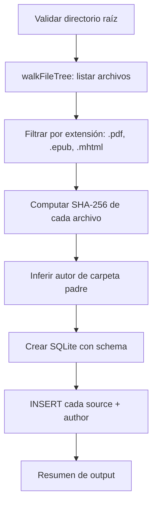
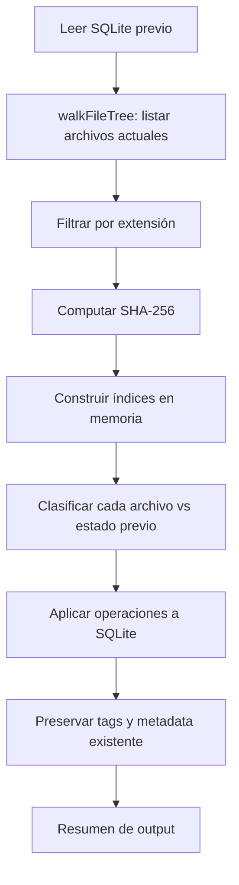
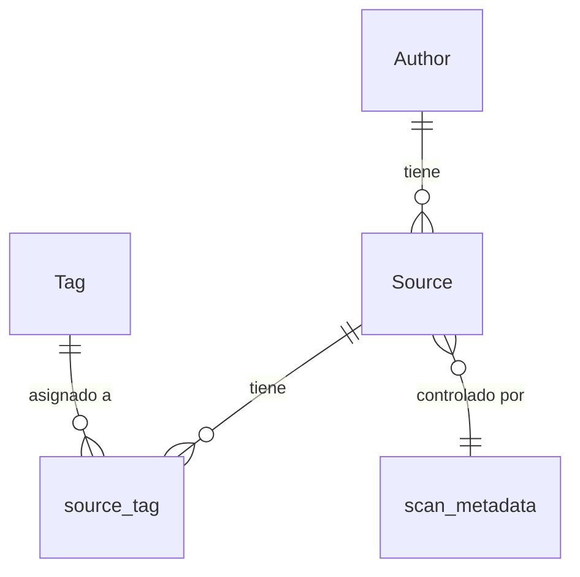
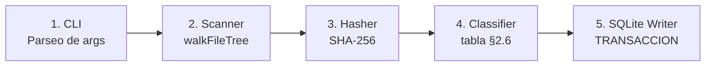

# agent_fs

## 1. Stack detallado de tecnologías y dependencias

### 1.1. Lenguaje y build

| Capa               | Tecnología  | Versión | Notas                                          |
|--------------------|-------------|---------|------------------------------------------------|
| Lenguaje           | Java        | 21      | LTS                                            |
| Build              | Maven       | —       | Wrapper en `agent/mvnw`                        |
| Base de datos      | SQLite      | —       | Archivo `.db portátil, gestionado vía JDBC     |
| SQLite JDBC        | sqlite-jdbc | 3.46    | Driver JDBC para SQLite, 0 dependencias extra  |
| Logging            | Log4j 2     | 2.23.1  | API directa (`log4j-api` + `log4j-core`)       |

### 1.2. APIs del JDK utilizadas

| API                                                        | Propósito                                                         |
|------------------------------------------------------------|-------------------------------------------------------------------|
| `java.nio.file.Files.walkFileTree()` + `SimpleFileVisitor` | Recorrido del árbol de directorios tolerante a fallos por archivo |
| `java.security.MessageDigest`                              | Cómputo de hash SHA-256                                           |
| `java.io.DigestInputStream`                                | Stream wrapper para hashear el contenido del archivo              |
| `java.sql.Connection`, `PreparedStatement`, `ResultSet`    | Acceso a SQLite vía JDBC                                          |
| `java.text.Normalizer`                                     | Normalización Unicode NFC de paths                                |

### 1.3. Dependencias externas (fuera del JDK)

| Dependencia                                  | Ámbito  | Justificación                                                  |
|----------------------------------------------|---------|----------------------------------------------------------------|
| `org.xerial:sqlite-jdbc:3.46`                | compile | Driver JDBC para SQLite. Acceso a la base de datos local       |
| `org.apache.logging.log4j:log4j-api:2.23.1`  | compile | API de logging                                                 |
| `org.apache.logging.log4j:log4j-core:2.23.1` | runtime | Implementación de Log4j (solo necesaria en runtime)            |
| `org.junit.jupiter:junit-jupiter:6.1.1`      | test    | Tests unitarios                                                |
| `org.mockito:mockito-junit-jupiter:5.17.0`   | test    | Extensión Mockito para JUnit Jupiter (`@Mock`, `@InjectMocks`) |

### 1.4. Configuración de logging

| Atributo           | Valor                                                              |
|--------------------|--------------------------------------------------------------------|
| Framework          | Log4j 2.23.1 (API directa, sin SLF4J)                              |
| Appender principal | Consola (stdout) con PatternLayout                                 |
| Formato            | `%d{HH:mm:ss} [%level] %msg%n`                                     |
| Nivel default      | INFO                                                               |
| Archivo de errores | stderr con nivel WARN+                                             |
| Nivel debug        | Activar con `--verbose` o variable de entorno `BIBLOCAT_LOG=DEBUG` |

El logging es intencionalmente simple: el CLI es una ejecución única, no un daemon. No se requieren
rotación de archivos, appenders asíncronos ni MDC complejo. La salida va directamente a consola para
que el usuario vea el progreso en tiempo real.

## 2. Escaneo del filesystem

### 2.1. Visión general

El escaneo es el proceso mediante el cual el agente recorre un directorio del filesystem, detecta archivos
de biblioteca (PDF, EPUB, MHTML), computa sus hashes, y almacena los metadatos en un archivo SQLite.

A diferencia del modelo daemon anterior, el agente CLI no mantiene ningún proceso en ejecución permanente.
El usuario ejecuta un comando, el agente escanea y genera/modifica el SQLite, y el proceso termina.

**Fuentes de verdad:**

| Fuente          | Contenido                                                  |
|-----------------|------------------------------------------------------------|
| Filesystem (FS) | Estado actual de los archivos (nombres, rutas, contenido)  |
| SQLite (.db)    | Estado conocido del catálogo (metadatos, tags, relaciones) |

El agente actúa como intermediario: computa el delta entre el FS y el estado previo del SQLite, y aplica
las operaciones resultantes directamente sobre el archivo `.db`.

**Flujo general:**

```mermaid
flowchart TD
    A[Usuario ejecuta CLI] --> B{Existe .sqlite?}
    B -- No --> C[Modo nuevo: scan completo desde cero]
    B -- Sí, con --db --> D[Modo comparativo: leer estado previo]
    C --> E[walkFileTree + hash + crear SQLite]
    D --> F[walkFileTree + hash + clasificar vs SQLite]
    E --> G[SQLite actualizado]
    F --> G
```

### 2.2. Modos de escaneo (nuevo vs comparativo)

El agente soporta dos modos de operación:

| Modo            | Comando                                                             | Descripción                                                           |
|-----------------|---------------------------------------------------------------------|-----------------------------------------------------------------------|
| **Nuevo**       | `java -jar biblocat.jar scan "C:\Biblioteca"`                       | Crea un archivo `biblocat.db` desde cero. No lee estado previo.       |
| **Comparativo** | `java -jar biblocat.jar scan "C:\Biblioteca" --db "C:\biblocat.db"` | Lee el `.db` existente, compara con el FS, actualiza con los cambios. |

**Cuándo usar cada modo:**

- **Nuevo:** Primera ejecución, o cuando el usuario quiere regenerar el catálogo completamente.
- **Comparativo:** Ejecuciones subsecuentes. Preserva tags, year, edition, url editados por el
  usuario en el frontend. Detecta archivos nuevos, renombrados, modificados y eliminados.

**Diferencias clave:**

| Aspecto                     | Nuevo                          | Comparativo                              |
|-----------------------------|--------------------------------|------------------------------------------|
| ¿Lee SQLite previo?         | No                             | Sí                                       |
| ¿Preserva tags del usuario? | No (genera SQLite limpio)      | Sí                                       |
| ¿Detecta renames?           | No (todo es CREATE)            | Sí (compara content hash)                |
| ¿Detecta deletes?           | No (no hay estado previo)      | Sí (archivos que desaparecieron)         |
| ¿Detecta soft-delete?       | No                             | Sí (archivos ausentes → deletedAt)       |

### 2.3. Escaneo completo (desde cero)

El escaneo completo genera un archivo SQLite nuevo con todos los archivos detectados.



**Pasos:**

1. Validar que el directorio raíz exista y sea un directorio.
2. Recorrer el árbol con `Files.walkFileTree()` + `SimpleFileVisitor`.
3. Filtrar archivos por extensión (`.pdf`, `.epub`, `.mhtml`, case-insensitive).
4. Computar SHA-256 de cada archivo.
5. Inferir autor desde la carpeta padre.
6. Crear el archivo SQLite con el schema completo.
7. Insertar cada source, author y establecer relaciones.
8. Imprimir resumen: X archivos escaneados, Y autores creados.

### 2.4. Escaneo comparativo (con .sqlite anterior)

El escaneo comparativo lee el estado previo del SQLite, compara con el FS actual, y aplica los cambios
necesarios. Es el modo estándar de uso.



**Pasos:**

1. Abrir el SQLite existente y leer el estado conocido: todos los sources con su id, path, pathLower,
   contentHash y deletedAt.
2. Recorrer el FS actual (walkFileTree + filtrado + hash).
3. Construir índices en memoria: `Map<pathLower, SourceState>` y `Map<contentHash, SourceState>`.
4. Clasificar cada archivo del FS contra el estado previo usando la tabla de §2.6.
5. Generar la lista de operaciones (CREATE, RENAME, UPDATE, DELETE, REACTIVATE).
6. Aplicar las operaciones al SQLite dentro de una transacción.
7. Preservar tags, year, edition, url de los sources existentes.
8. Imprimir resumen: X creados, Y renombrados, Z actualizados, W eliminados.

### 2.5. Escaneo del directorio

El agente recorre el directorio raíz de biblioteca usando la API estándar de Java NIO.

**Tecnología:** `java.nio.file.Files.walkFileTree(rootDir, options, maxDepth, visitor)` con `SimpleFileVisitor<Path>`

**Reglas de escaneo:**

- `SimpleFileVisitor` sobrescribe `visitFileFailed(Path file, IOException exc)` para retornar
  `FileVisitResult.CONTINUE`. Esto permite que errores por archivo (nombres reservados de Windows, permisos denegados,
  desconexión de red) no aborten el escaneo completo — el archivo se loguea como WARN y se omite.
- `SimpleFileVisitor` sobrescribe `preVisitDirectory(Path dir, BasicFileAttributes attrs)`. Si el directorio no es
  legible, retorna `FileVisitResult.SKIP_SUBTREE` con log WARN.
- Profundidad máxima configurable (default: 10 niveles).
- No se siguen symlinks ni junctions (`FOLLOW_LINKS` no se establece).
- Se filtran únicamente archivos con extensiones `.pdf`, `.epub`, `.mhtml` (comparación case-insensitive).
- Archivos con otras extensiones se registran en log DEBUG y se omiten.
- Archivos bloqueados por otro proceso se saltan con log WARN.
- Archivos que desaparecen durante el escaneo se manejan como si nunca hubieran existido.
- El directorio raíz se resuelve con `rootDir.toRealPath()` al iniciar, para eliminar dependencia de symlinks o
  junctions. El path real se usa durante toda la sesión.
- Antes de cada `walkFileTree` se verifica que el directorio raíz exista. Si no existe, se aborta.

**Normalización de paths:**

- Separadores `\` se convierten a `/`.
- Se preserva el casing original del archivo para mostrar al usuario.
- Para comparación se genera un campo `pathLower` (lowercase + `/`), almacenado en SQLite para detección de duplicados.
- Los paths se normalizan a Unicode NFC (`Normalizer.normalize(path, Normalizer.Form.NFC)`) para consistencia con la
  normalización NFC nativa de Windows.

### 2.6. Clasificación de archivos

Por cada archivo en el FS, el agente determina su relación con el estado conocido (almacenado en SQLite)
aplicando la siguiente tabla de decisión:

| # | Archivo en FS | Existe en SQLite (path) | Hash coincide       | `deletedAt` en SQLite | Clasificación                    |
|---|---------------|-------------------------|---------------------|-----------------------|----------------------------------|
| A | Sí            | Sí                      | Sí                  | `null`                | Sin cambios — skip               |
| B | Sí            | Sí                      | Sí                  | ≠ `null`              | **REACTIVATE**                   |
| C | Sí            | Sí                      | No                  | `null`                | **UPDATE** (safe-save)           |
| D | Sí            | No                      | Sí (en otro source) | cualquiera            | **RENAME**                       |
| E | Sí            | No                      | No                  | —                     | **CREATE**                       |
| F | No            | Sí                      | —                   | `null`                | **DELETE** (soft-delete)         |
| G | No            | Sí                      | —                   | ≠ `null`              | Sigue siendo orphan — skip       |
| H | Sí            | Sí                      | No                  | ≠ `null`              | **CREATE** (orphan sigue orphan) |

**Notas sobre la clasificación:**

- Los casos **D** y **E** requieren computar el hash para determinar si el archivo es un renombre o es realmente nuevo.
- El caso **B** requiere computar hash para confirmar que el contenido coincide (seguridad ante falsas reactivaciones).
- El caso **H** captura archivos que aparecen donde antes había un source soft-deleteado, pero con contenido diferente.
  No se reactiva — se crea un nuevo source y el orphan sigue huérfano.
- **Caso D (RENAME):** Si el source origen del RENAME está soft-deleteado (`deletedAt ≠ null`), el agente lo reactiva
  (limpia `deletedAt`) al procesar el RENAME. Si múltiples sources tienen el mismo hash que el archivo en FS, se
  prioriza: (1) activos sobre soft-deleteados, (2) path alfabéticamente menor.
- Para el caso **A**, el hash se computa siempre (no hay optimización activa).
- **Caso F (DELETE):** El agente determina el `sourceId` desde el estado previo del SQLite. Si el mismo `sourceId`
  aparece como RENAME (caso D) en el mismo escaneo, el DELETE se omite — el source fue movido, no eliminado. El agente
  mantiene un conjunto (`Set<sourceId>`) de sources renombrados durante todo el escaneo.

### 2.7. Cómputo de hash SHA-256

**Algoritmo:** `java.security.MessageDigest.getInstance("SHA-256")` combinado con `DigestInputStream`.

**Modalidad:** Secuencial (un archivo a la vez). El cuello de botella suele ser I/O de disco, no CPU.

**Protecciones:**

- Timeout configurable por archivo (default: 30s). Si expira, se salta y se reintenta en la próxima ejecución.
- Tamaño máximo configurable (default: 500 MB). Archivos mayores se saltan con log WARN.
- Si el archivo se trunca o desaparece durante la lectura, se captura la `IOException`, se loguea y se continúa.
- **Write race:** se verifica `Files.size()` antes y después del cómputo de hash. Si el tamaño cambió durante la
  lectura, se descarta el hash y se incrementa un contador de reintentos consecutivos para ese archivo. Se
  salta con log WARN si el contador es ≤ `--hash-max-retries`, o log ERROR si lo supera. El
  archivo se reintenta en la próxima ejecución del CLI. El contador se
  resetea al hashear exitosamente. El contador es volátil (memoria, se pierde al terminar el proceso).

**Optimización:** No implementada. El agente computa SHA-256 siempre que la tabla de clasificación lo requiere.

### 2.8. Inferencia de autor

El agente extrae el nombre del autor desde la carpeta padre inmediata dentro del directorio raíz.

**Reglas:**

1. Se calcula el path relativo del archivo respecto al directorio raíz.
2. El primer segmento del path relativo es el nombre de la carpeta del autor.
3. Si el archivo está directamente en la raíz (sin subdirectorios), `authorName = null`.
4. El nombre se normaliza: strip (eliminar espacios al inicio y final). Se preserva el casing original del nombre de la
   carpeta.
5. El agente busca o crea la entidad Author en SQLite por nombre. Si ya existe, reutiliza su ID.

**Ejemplos:**

| Path en FS                                                   | authorName inferido      |
|--------------------------------------------------------------|--------------------------|
| `biblioteca/Gabriel García Márquez/Cien años de soledad.pdf` | `Gabriel García Márquez` |
| `biblioteca/Anónimo/poema.pdf`                               | `Anónimo`                |
| `biblioteca/libro.pdf`                                       | `null`                   |

**RENAME:** El agente re-infere el autor del nuevo path usando las mismas reglas (§2.8) y actualiza el
`author_id` del source en SQLite. Si el autor cambió, se busca o crea el nuevo autor.

### 2.9. Edge cases

Los edge cases se organizan por la fase del proceso de escaneo en la que ocurren.

#### A. Previo al escaneo — validaciones antes de iniciar

| # | Caso                                                    | Comportamiento                                                                                                                                         |
|---|---------------------------------------------------------|--------------------------------------------------------------------------------------------------------------------------------------------------------|
| 1 | Root-dir es symlink / junction                          | Resolver con `rootDir.toRealPath()` al iniciar. Log INFO con el path real. Usar el path resuelto durante toda la sesión.                               |
| 2 | Root-dir no existe al iniciar                           | Validar con `Files.exists()` y `Files.isDirectory()`. Si no existe: log ERROR, abortar con código de salida ≠ 0. Esperar intervención del usuario.     |
| 3 | Network drive se desconecta durante el walk             | Capturar `AccessDeniedException`. Verificar que root siga respondiendo antes de generar soft-deletes masivos. Si root no responde: abortar, log ERROR. |
| 4 | Root-dir se renombra o elimina mientras el agente corre | Antes de cada walk verificar que root exista. Si no: abortar, log ERROR. No reintentar automáticamente.                                                |
| 5 | Path excede el límite de longitud del SO                | El agente usa exclusivamente NIO (Java 21), que soporta paths largos nativamente sin `\\?\`. No se requiere acción.                                    |

#### B. Durante el escaneo del árbol

| #  | Caso                                                            | Comportamiento                                                                                                     |
|----|-----------------------------------------------------------------|--------------------------------------------------------------------------------------------------------------------|
| 6  | Archivos ocultos                                                | Se procesan (atributo Hidden). Log DEBUG.                                                                          |
| 7  | Nombres reservados de Windows (`CON`, `NUL`, `COM1`, `aux.txt`) | `visitFileFailed()` en `SimpleFileVisitor` retorna `FileVisitResult.CONTINUE`. Log WARN con el nombre del archivo. |
| 8  | Profundidad de directorios excedida                             | Ignorar archivos más allá del límite configurado, log DEBUG.                                                       |
| 9  | Extensión no soportada (`.txt`, `.doc`, etc.)                   | Saltar, log DEBUG.                                                                                                 |
| 10 | Carpetas sin archivos compatibles                               | Ignoradas. No generan ninguna operación.                                                                           |

#### C. Durante el cómputo de hash

| #  | Caso                                                      | Comportamiento                                                                                                                                                   |
|----|-----------------------------------------------------------|------------------------------------------------------------------------------------------------------------------------------------------------------------------|
| 11 | Archivo bloqueado / siendo escrito por otro proceso       | Saltar, log WARN. Se reintenta en la próxima ejecución del CLI.                                                                                                  |
| 12 | Archivo sin permisos de lectura (`AccessDeniedException`) | Saltar, log WARN.                                                                                                                                                |
| 13 | Archivo de 0 bytes                                        | Procesar normalmente. SHA-256 del contenido vacío es un valor conocido y válido.                                                                                 |
| 14 | Archivo mayor al tamaño máximo configurable               | Saltar, log WARN. No se computa hash ni se cataloga.                                                                                                             |
| 15 | Timeout de hash excedido                                  | Saltar, log WARN. Se reintenta en la próxima ejecución.                                                                                                          |
| 16 | Archivo desaparece durante el hash (`IOException`)        | Saltar, log DEBUG.                                                                                                                                               |
| 17 | **Write race** — archivo siendo escrito durante el hash   | Verificar `Files.size()` antes y después del cómputo. Si el tamaño cambió: descartar el hash, saltar el archivo, log WARN. Se reintenta en la próxima ejecución. |
| 18 | Archivo se trunca durante la lectura                      | Caso tolerado. `DigestInputStream` captura la `IOException`. Log WARN, continuar con el siguiente archivo.                                                       |

#### D. Clasificación

| #  | Caso                                                      | Comportamiento                                                                                                                                                                                                                                                                                                                                                           |
|----|-----------------------------------------------------------|--------------------------------------------------------------------------------------------------------------------------------------------------------------------------------------------------------------------------------------------------------------------------------------------------------------------------------------------------------------------------|
| 19 | Carpeta de autor renombrada en el FS                      | Cada archivo se clasifica como RENAME. El agente actualiza el author en cada source.                                                                                                                                                                                                                                                                                     |
| 20 | Hash duplicado con path diferente                         | Clasificar como RENAME.                                                                                                                                                                                                                                                                                                                                                  |
| 21 | Archivo en raíz del directorio de biblioteca              | `authorName = null`. `author_id` queda NULL en SQLite.                                                                                                                                                                                                                                                                                                                   |
| 22 | Múltiples archivos con el mismo contenido (hash idéntico) | Agrupar por hash. Si hay más de un CREATE con el mismo hash, usar orden alfabético de path como tiebreaker para garantizar comportamiento determinista.                                                                                                                                                                                                                  |
| 23 | Dos archivos que difieren solo en casing                  | No aplica. Windows tiene FS case-insensitive, `Files.walkFileTree()` nunca puede encontrar dos archivos que difieran solo en casing. El índice único en `pathLower` en SQLite se mantiene como restricción de integridad.                                                                                                                                                |
| 24 | Unicode NFC en nombres de archivo                         | Normalizar con `Normalizer.normalize(path, Normalizer.Form.NFC)` al leer del FS y al computar `pathLower`. Consistencia con la normalización NFC nativa de Windows.                                                                                                                                                                                                      |
| 25 | RENAME con `sourceId` de un source soft-deleteado         | El agente clasifica como RENAME si el hash coincide con un source con `deletedAt ≠ null` (caso D de §2.6). El agente debe: (1) limpiar `deletedAt`, (2) actualizar `path` y `pathLower`, (3) actualizar `authorName` si cambió, (4) preservar metadatos (tags, año, URL). El RENAME sobre soft-deleteado siempre reactiva — no debe lanzar error por `deletedAt ≠ null`. |

#### E. Post-procesamiento y solapamiento

| #  | Caso                                                                         | Comportamiento                                                                                                                                                                                                                                                                                                                                                                                                                                                                                                                                                                                                                                          |
|----|------------------------------------------------------------------------------|---------------------------------------------------------------------------------------------------------------------------------------------------------------------------------------------------------------------------------------------------------------------------------------------------------------------------------------------------------------------------------------------------------------------------------------------------------------------------------------------------------------------------------------------------------------------------------------------------------------------------------------------------------|
| 26 | Orphan reactivado con hash distinto al almacenado                            | Evaluar `deletedAt` primero. Si `deletedAt ≠ null` y hash coincide → REACTIVATE. Si `deletedAt ≠ null` y hash **no** coincide → CREATE (nuevo source) y el orphan sigue huérfano. Esto ya está reflejado en la tabla de clasificación (§2.6) con el caso H.                                                                                                                                                                                                                                                                                                                                                                                             |
| 27 | Move cross-filesystem (Safe-save que cruza FS)                               | El archivo se mueve entre volúmenes distintos (ej: C:\ → D:\). Windows implementa el move cross-filesystem como COPY+DELETE, no como rename atómico. El agente lo detecta como CREATE + DELETE con hashes distintos. Los metadatos originales se preservan en el soft-delete del source original. El agente implementa transferencia de metadatos por `contentHash` en CREATE: al crear un source, busca un soft-deleteado con el mismo hash. Si hay exactamente 1, transfiere los metadatos al nuevo source y purga el orphan. Si hay 0 o >1, no transfiere. **Limitación intra-ejecución:** la transferencia solo funciona entre ejecuciones del CLI. |
| 28 | Archivo de 0 bytes que luego se escribe con contenido                        | CREATE con hash vacío, luego UPDATE en la siguiente ejecución. El source existe brevemente con metadatos vacíos, comportamiento correcto.                                                                                                                                                                                                                                                                                                                                                                                                                                                                                                               |
| 29 | Archivos duplicados con el mismo contenido (hash idéntico)                   | El caso D clasifica el archivo como RENAME cuando su hash coincide con un source existente, incluso si el usuario solo duplicó el archivo (no lo renombró). El source con metadatos "sigue" al nuevo path; el path original se recrea como CREATE en la próxima ejecución con metadatos vacíos. Comportamiento determinista gracias al tiebreaker alfabético (§2.6). Impacto bajo.                                                                                                                                                                                                                                                                      |
| 30 | **Safe-save en el mismo FS** — aplicaciones que usan el patrón DELETE+CREATE | Entre el DELETE y el CREATE hay una ventana (ms) donde el archivo no existe en el FS. Si el escaneo ocurre en esa ventana, el source se clasifica como DELETE (caso F). En la próxima ejecución, el archivo reaparece con hash distinto → CREATE (caso E/H). Los metadatos se preservan en el orphan. Si el agente implementa transferencia por hash (ver EC27), se recuperan automáticamente en el CREATE. Probabilidad: baja. Impacto: medio.                                                                                                                                                                                                         |
| 31 | **DELETE de source renombrado en el mismo escaneo**                          | El agente filtra DELETE cuyo `sourceId` coincide con un RENAME del mismo escaneo. Usa un `Set<sourceId>` global al escaneo (no por batch). Esto evita soft-deletear el source que fue movido. El path viejo simplemente queda libre — no requiere DELETE.                                                                                                                                                                                                                                                                                                                                                                                               |
| 32 | **Orden de operaciones**                                                     | El agente aplica operaciones en el orden: RENAME → UPDATE → REACTIVATE → CREATE → DELETE dentro de una transacción SQLite. Esto garantiza que RENAME se procese antes que DELETE del mismo source (ver EC31), y que REACTIVATE tenga prioridad sobre CREATE para el mismo path.                                                                                                                                                                                                                                                                                                                                                                         |

## 3. Persistencia SQLite

### 3.1. Schema de la base de datos

El agente crea y gestiona un archivo SQLite con el siguiente schema:

```sql
-- Autores inferidos de la estructura de carpetas
CREATE TABLE IF NOT EXISTS authors (
    id TEXT PRIMARY KEY,   -- UUID v4 como TEXT (sin guiones)
    name TEXT NOT NULL UNIQUE
);

-- Sources (archivos PDF, EPUB, MHTML)
CREATE TABLE IF NOT EXISTS sources (
    id TEXT PRIMARY KEY,                    -- UUID v4 como TEXT
    name TEXT NOT NULL,                     -- Nombre del archivo con extensión
    path TEXT NOT NULL,                     -- Path relativo desde root-dir
    path_lower TEXT NOT NULL,               -- Path normalizado (lowercase + /)
    content_hash TEXT NOT NULL,             -- SHA-256 hex de 64 caracteres
    file_format TEXT NOT NULL               -- 'PDF', 'EPUB' o 'MHTML'
        CHECK (file_format IN ('PDF', 'EPUB', 'MHTML')),
    author_id TEXT REFERENCES authors(id)
        ON DELETE SET NULL,                 -- Autor inferido de carpeta padre
    year INTEGER,                           -- Año de publicación (nullable)
    edition TEXT,                           -- Edición (nullable)
    url TEXT,                               -- URL asociada (nullable)
    created_at TEXT NOT NULL,               -- ISO 8601
    updated_at TEXT NOT NULL,               -- ISO 8601
    deleted_at TEXT                         -- NULL = activo, ≠ NULL = orphan
);

-- Índices para sources
CREATE UNIQUE INDEX IF NOT EXISTS uq_sources_active_path_lower
    ON sources(path_lower) WHERE deleted_at IS NULL;

CREATE INDEX IF NOT EXISTS idx_sources_content_hash
    ON sources(content_hash);

CREATE INDEX IF NOT EXISTS idx_sources_author_id
    ON sources(author_id);

-- Tags creados por el usuario
CREATE TABLE IF NOT EXISTS tags (
    id TEXT PRIMARY KEY,                    -- UUID v4 como TEXT
    name TEXT NOT NULL UNIQUE               -- Nombre normalizado (lowercase)
);

-- Relación muchos a muchos sources ↔ tags
CREATE TABLE IF NOT EXISTS source_tags (
    source_id TEXT NOT NULL
        REFERENCES sources(id) ON DELETE CASCADE,
    tag_id TEXT NOT NULL
        REFERENCES tags(id) ON DELETE CASCADE,
    PRIMARY KEY (source_id, tag_id)
);

-- Metadata del escaneo (control de versiones y estado)
CREATE TABLE IF NOT EXISTS scan_metadata (
    key TEXT PRIMARY KEY,
    value TEXT NOT NULL
);

-- Seeds iniciales
INSERT OR IGNORE INTO scan_metadata (key, value) VALUES
    ('db_version', '1'),
    ('created_at', '<ISO 8601 de la primera ejecución>'),
    ('last_scan_at', '<ISO 8601 del último scan>');
```

### 3.2. Tablas y relaciones

**Diagrama entidad-relación:**



**Descripción de tablas:**

| Tabla           | Registros                             | Relaciones                                                        |
|-----------------|---------------------------------------|-------------------------------------------------------------------|
| `authors`       | Un autor por cada carpeta padre única | Un autor tiene muchos sources (`1:N`)                             |
| `sources`       | Un source por cada archivo detectado  | Un source pertenece a un autor (`N:1`), tiene muchos tags (`N:M`) |
| `tags`          | Tags creados por el usuario           | Un tag está asociado a muchos sources (`N:M`)                     |
| `source_tags`   | Tabla de unión sources ↔ tags         | FKs con `ON DELETE CASCADE`                                       |
| `scan_metadata` | Pares clave-valor de control          | Sin relaciones FK                                                 |

**Comportamientos de eliminación:**

| FK                                    | Comportamiento                     |
|---------------------------------------|------------------------------------|
| `sources.author_id → authors.id`      | `ON DELETE SET NULL`               |
| `source_tags.source_id → sources.id`  | `ON DELETE CASCADE`                |
| `source_tags.tag_id → tags.id`        | `ON DELETE CASCADE`                |

### 3.3. Gestión de la conexión

**Connection string:**

```
jdbc:sqlite:C:\Users\usuario\Documents\biblocat.db
```

**PRAGMAs de configuración (al abrir la conexión):**

```sql
PRAGMA journal_mode = WAL;          -- Write-Ahead Logging: mejor concurrencia y recuperación
PRAGMA synchronous = NORMAL;        -- Equilibrio entre rendimiento y seguridad
PRAGMA foreign_keys = ON;           -- Habilitar restricciones de FK
PRAGMA busy_timeout = 5000;         -- Esperar 5s si el archivo está bloqueado
```

**WAL (Write-Ahead Logging):** Permite lecturas concurrentes con escrituras. En el contexto del CLI
(escribir todo de golpe), la ventaja principal es la recuperación ante crashes: si el proceso muere
a mitad de una transacción, el WAL permite recuperar el estado anterior sin corrupción.

**Abrir/cerrar conexión:**

```java
// Abrir
Connection conn = DriverManager.getConnection("jdbc:sqlite:" + dbPath);
try (Statement stmt = conn.createStatement()) {
    stmt.execute("PRAGMA journal_mode = WAL");
    // ...
}

// Cerrar
conn.close();  // Se cierra automáticamente al usar try-with-resources
```

### 3.4. Operaciones de lectura

**Listar sources activos:**

```sql
SELECT s.id, s.name, s.path, s.path_lower, s.content_hash, s.file_format,
       s.author_id, a.name AS author_name,
       s.year, s.edition, s.url,
       s.created_at, s.updated_at, s.deleted_at
FROM sources s
LEFT JOIN authors a ON s.author_id = a.id
WHERE s.deleted_at IS NULL
ORDER BY s.path_lower;
```

**Obtener estado previo para clasificación (modo comparativo):**

```sql
SELECT id, path, path_lower, content_hash, deleted_at
FROM sources
WHERE deleted_at IS NULL
   OR deleted_at IS NOT NULL;
```

Esta query retorna todos los sources (activos y orphans) con los campos mínimos necesarios para la
clasificación. El agente construye los índices en memoria a partir de este resultado.

**Buscar author por nombre:**

```sql
SELECT id FROM authors WHERE name = ?;
```

**Listar tags:**

```sql
SELECT id, name FROM tags ORDER BY name;
```

**Listar tags de un source:**

```sql
SELECT t.id, t.name
FROM tags t
JOIN source_tags st ON t.id = st.tag_id
WHERE st.source_id = ?
ORDER BY t.name;
```

### 3.5. Operaciones de escritura

**Transacciones:** Todas las operaciones de escritura se ejecutan dentro de una transacción SQLite
para garantizar atomicidad. Si cualquier operación falla, se revierten todos los cambios.

```java
conn.setAutoCommit(false);
try {
    // ... operaciones INSERT/UPDATE/DELETE ...
    conn.commit();
} catch (Exception e) {
    conn.rollback();
    throw e;
} finally {
    conn.setAutoCommit(true);
}
```

**INSERT source:**

```sql
INSERT INTO sources (id, name, path, path_lower, content_hash, file_format, author_id, created_at, updated_at)
VALUES (?, ?, ?, ?, ?, ?, ?, ?, ?);
```

**UPDATE source (safe-save / renombre):**

```sql
UPDATE sources
SET path = ?, path_lower = ?, content_hash = ?, author_id = ?, updated_at = ?
WHERE id = ?;
```

**Soft-delete source:**

```sql
UPDATE sources
SET deleted_at = ?, updated_at = ?
WHERE id = ? AND deleted_at IS NULL;
```

**Reactivar source:**

```sql
UPDATE sources
SET deleted_at = NULL, path = ?, path_lower = ?, content_hash = ?, author_id = ?, updated_at = ?
WHERE id = ?;
```

**UPSERT author (buscar o crear):**

```sql
INSERT INTO authors (id, name) VALUES (?, ?)
ON CONFLICT(name) DO NOTHING;
SELECT id FROM authors WHERE name = ?;
```

**Asignar tags a un source (reemplazar todas):**

```sql
DELETE FROM source_tags WHERE source_id = ?;
INSERT INTO source_tags (source_id, tag_id) VALUES (?, ?);
-- ... repetir por cada tag
```

**Actualizar metadata del scan:**

```sql
INSERT OR REPLACE INTO scan_metadata (key, value) VALUES ('last_scan_at', ?);
```

### 3.6. Migraciones de schema

El agente maneja migraciones de schema de forma versionada utilizando la tabla `scan_metadata`.

**Flujo de migración:**

1. Al abrir la conexión, leer `db_version` de `scan_metadata`.
2. Si la tabla `scan_metadata` no existe → es una base de datos nueva → crear schema completo (V1).
3. Comparar `db_version` leído con la versión que espera el código del agente.
4. Si son iguales → no hacer nada.
5. Si el código es más reciente → ejecutar migraciones secuenciales hasta alcanzar la versión del código.
6. Actualizar `db_version` en `scan_metadata`.

**Ejemplo de tabla de migraciones:**

| Versión | Descripción                            | SQL                                                             |
|---------|----------------------------------------|-----------------------------------------------------------------|
| V0001   | Schema inicial                         | CREATE TABLE sources, authors, tags, source_tags, scan_metadata |
| V0002   | Agregar columna `notes` a sources      | `ALTER TABLE sources ADD COLUMN notes TEXT`                     |
| V0003   | Índice adicional para búsqueda por año | `CREATE INDEX idx_sources_year ON sources(year)`                |

**Código de referencia (pseudocódigo):**

```java
int currentVersion = getDbVersion(conn);
int targetVersion = SchemaVersion.CURRENT;

while (currentVersion < targetVersion) {
    currentVersion++;
    String sql = Migrations.getSql(currentVersion);
    try (Statement stmt = conn.createStatement()) {
        stmt.execute(sql);
    }
    setDbVersion(conn, currentVersion);
}
```

### 3.7. Backup automático

Antes de aplicar cambios en modo comparativo, el agente crea una copia de seguridad del archivo SQLite.

**Reglas:**

1. Solo se crea backup en modo comparativo (cuando el `.db` ya existe).
2. El backup se renombra a `.db.bak` (reemplaza el backup anterior).
3. Se mantiene solo el último backup (no hay históricos).
4. Si el backup falla (permisos, disco lleno), se loguea WARN pero el escaneo continúa.

**Flujo:**

```
biblocat.db      → se lee el estado previo
biblocat.db.bak  → se crea como copia del original (Files.copy con REPLACE)
biblocat.db      → se sobrescribe con los nuevos datos
```

**Nota:** Si el usuario quiere mantener un histórico de backups, debe hacerlo manualmente antes de ejecutar el CLI.

## 4. CLI — Interfaz de línea de comandos

### 4.1. Comandos disponibles

El agente expone un único comando:

| Comando | Descripción                                                         |
|---------|---------------------------------------------------------------------|
| `scan`  | Escanea un directorio y genera o actualiza un archivo SQLite (.db)  |

**Uso general:**

```
java -jar biblocat.jar <comando> [argumentos] [opciones]
```

### 4.2. Argumentos y opciones

**Argumentos posicionales:**

| Argumento      | Requerido | Descripción                                       |
|----------------|-----------|---------------------------------------------------|
| `<directorio>` | Sí        | Ruta al directorio de la biblioteca a escanear    |

**Opciones:**

| Opción                   | Tipo   | Default                    | Descripción                                                                                       |
|--------------------------|--------|----------------------------|---------------------------------------------------------------------------------------------------|
| `--db <path>`            | string | `<directorio>/biblocat.db` | Ruta al archivo SQLite. Si no existe, se crea (modo nuevo). Si existe, se usa (modo comparativo). |
| `--max-depth <n>`        | int    | 10                         | Profundidad máxima de subdirectorios a escanear                                                   |
| `--hash-timeout <s>`     | int    | 30                         | Timeout máximo por archivo para el cómputo de hash (segundos)                                     |
| `--max-file-size <mb>`   | int    | 500                        | Tamaño máximo de archivo para hashear (MB). 0 = sin límite                                        |
| `--hash-max-retries <n>` | int    | 3                          | Reintentos de hash antes de loguear ERROR por write-race                                          |
| `--verbose`              | flag   | false                      | Activar logging DEBUG                                                                             |
| `--help`                 | flag   | —                          | Mostrar ayuda y salir                                                                             |

### 4.3. Modo nuevo (scan sin --db)

Cuando el usuario ejecuta el CLI sin la opción `--db`, el agente crea un archivo SQLite nuevo.

**Comando:**

```bash
java -jar biblocat.jar scan "C:\Users\usuario\Documents\Biblioteca"
```

**Comportamiento:**

1. Crea `biblocat.db` en el directorio actual (o en la ruta especificada por `--db`).
2. Crea el schema completo (tablas, índices, constraints).
3. Escanea el directorio de biblioteca.
4. Inserta todos los archivos detectados como sources nuevos.
5. Infiere autores desde las carpetas.
6. No hay clasificación ni comparación — todo es CREATE.

**Output esperado:**

```
BiblioCat Agent v1.0 — Escaneo nuevo
Directorio: C:\Users\usuario\Documents\Biblioteca
SQLite:     C:\Users\usuario\Documents\Biblioteca\biblocat.db

Escaneando archivos...
  PDF:  142
  EPUB:  67
  MHTML: 12

Computando hashes...
  Procesados: 221
  Errores:     3 (timeout, permisos)

Generando base de datos...
  Sources creados:  221
  Autores creados:   18

Completado en 4.2s
```

### 4.4. Modo comparativo (scan con --db)

Cuando el usuario ejecuta el CLI con la opción `--db` apuntando a un archivo existente, el agente
compara el estado previo con el FS actual.

**Comando:**

```bash
java -jar biblocat.jar scan "C:\Users\usuario\Documents\Biblioteca" --db "C:\Users\usuario\Documents\biblocat.db"
```

**Comportamiento:**

1. Abre el SQLite existente.
2. Lee el estado previo (todos los sources con su path, hash, deletedAt).
3. Crea backup: renombra `biblocat.db` → `biblocat.db.bak`.
4. Escanea el FS actual.
5. Clasifica cada archivo contra el estado previo (tabla §2.6).
6. Aplica las operaciones resultantes (CREATE, RENAME, UPDATE, DELETE, REACTIVATE).
7. Preserva tags, year, edition, url de los sources existentes.
8. Actualiza `last_scan_at` en `scan_metadata`.

**Output esperado:**

```
BiblioCat Agent v1.0 — Escaneo comparativo
Directorio: C:\Users\usuario\Documents\Biblioteca
SQLite:     C:\Users\usuario\Documents\biblocat.db
Backup:     C:\Users\usuario\Documents\biblocat.db.bak

Estado previo: 218 sources (215 activos, 3 orphans)
Escaneando archivos...
  PDF:  145
  EPUB:  68
  MHTML: 12

Computando hashes...
  Procesados: 225
  Errores:     2 (timeout)

Clasificando...
  Sin cambios:   210
  Creados:         3
  Renombrados:     1
  Actualizados:    2
  Eliminados:      1
  Reactivados:     0

Completado en 5.1s
```

### 4.5. Mensajes de salida y códigos de retorno

**Códigos de retorno:**

| Código | Significado                                                                |
|--------|----------------------------------------------------------------------------|
| 0      | Éxito — el escaneo se completó correctamente                               |
| 1      | Error — el directorio no existe, no se pudo crear el SQLite, o error fatal |

**Formato de salida:**

| Canal  | Contenido                                                               |
|--------|-------------------------------------------------------------------------|
| stdout | Información del escaneo: progreso, resumen de operaciones, estadísticas |
| stderr | Errores: archivos que fallaron, warnings, mensajes de error             |

**Reglas de output:**

- Cada paso imprime una línea con su progreso.
- Los errores de archivos individuales se acumulan y se imprimen al final (no interrumpen el progreso).
- El resumen final muestra conteos por tipo de operación.
- Con `--verbose`, se imprime información adicional de debug (paths individuales, clasificación por archivo).

## 5. Pipeline de procesamiento

### 5.1. Secuencia completa

El pipeline de procesamiento consta de 5 fases que se ejecutan secuencialmente:



| Fase           | Entrada                  | Salida                          | Descripción                                  |
|----------------|--------------------------|---------------------------------|----------------------------------------------|
| **CLI**        | Argumentos de línea      | Configuración parseada          | Validar args, resolver paths, abrir conexión |
| **Scanner**    | Directorio raíz          | `List<NormalizedPath>`          | Walk del árbol, filtrar, normalizar paths    |
| **Hasher**     | `List<NormalizedPath>`   | `List<NormalizedPath>` con hash | Computar SHA-256 de cada archivo             |
| **Classifier** | FS hashes + SQLite state | `List<Operation>`               | Clasificar cada archivo contra estado previo |
| **Writer**     | `List<Operation>`        | SQLite actualizado              | Aplicar operaciones en transacción           |

**Nota:** No hay batching HTTP ni comunicación con servidores. Las operaciones se aplican directamente
a SQLite dentro de una única transacción.

### 5.2. Clasificación contra estado previo

El Classifier es la fase más compleja del pipeline. Recibe los hashes del FS y el estado previo de
SQLite, y genera la lista de operaciones a ejecutar.

**Construcción de índices en memoria:**

```java
// Índice por pathLower (para detectar existencia por path)
Map<String, SourceState> byPathLower = new HashMap<>();
for (SourceState state : previousState) {
    byPathLower.put(state.pathLower(), state);
}

// Índice por contentHash (para detectar renames)
Map<String, List<SourceState>> byHash = new HashMap<>();
for (SourceState state : previousState) {
    byHash.computeIfAbsent(state.contentHash(), k -> new ArrayList<>()).add(state);
}
```

**Proceso de clasificación:**

Para cada archivo del FS (con hash ya computado):

1. Buscar por `pathLower` en `byPathLower`.
2. Si existe → comparar hash → clasificar como A, B, C, o H.
3. Si no existe → buscar por `contentHash` en `byHash` → clasificar como D (rename) o E (create).
4. Al final, recorrer `byPathLower` para detectar archivos que están en SQLite pero no en FS → clasificar como F o G.

**Manejo de renames con soft-delete:** Si el source origen del RENAME está soft-deleteado, el agente
lo reactiva automáticamente al procesar la operación RENAME.

### 5.3. Preservación de tags y metadata

En modo comparativo, el agente preserva los datos editados por el usuario en el frontend.

**Campos que se preservan (no se tocan en escaneo comparativo):**

| Campo     | Razón de preservación                                    |
|-----------|----------------------------------------------------------|
| `year`    | Editado manualmente por el usuario                       |
| `edition` | Editado manualmente por el usuario                       |
| `url`     | Editado manualmente por el usuario                       |
| `tags`    | Asignados/eliminados por el usuario en el frontend       |

**Campos que se actualizan siempre:**

| Campo          | Razón de actualización                                     |
|----------------|------------------------------------------------------------|
| `path`         | Puede cambiar por renombre o move                          |
| `path_lower`   | Se recalcula siempre                                       |
| `content_hash` | Se recalcula siempre                                       |
| `author_id`    | Se re-infere del path actualizado                          |
| `deleted_at`   | Se establece/limpia según la clasificación                 |
| `updated_at`   | Se actualiza en cada modificación                          |

**Excepción — campo `name`:** El nombre del source (`name`) se actualiza solo si el path cambió
(rename). Si el archivo se modifica en el mismo path (safe-save, caso C), el nombre no cambia.

### 5.4. Orden de operaciones

Las operaciones se aplican en un orden específico para garantizar consistencia:

| Orden | Operación      | Descripción                                                       |
|-------|----------------|-------------------------------------------------------------------|
| 1     | **RENAME**     | Actualiza path y pathLower del source existente                   |
| 2     | **UPDATE**     | Actualiza contentHash del source existente                        |
| 3     | **REACTIVATE** | Limpia deletedAt, actualiza path y hash del source soft-deleteado |
| 4     | **CREATE**     | Crea un nuevo source con los metadatos del FS                     |
| 5     | **DELETE**     | Establece deletedAt (soft-delete) del source ausente del FS       |

**Razón del orden:**

- RENAME antes que DELETE: evita soft-deletear un source que fue movido (ver EC31).
- REACTIVATE antes que CREATE: evita duplicar un source que reapareció.
- CREATE antes que DELETE: permite que la transferencia de metadatos por hash funcione entre ejecuciones.

**Implementación en SQLite:**

```java
conn.setAutoCommit(false);
try {
    for (Operation op : operations) {
        switch (op.type()) {
            case RENAME -> sourceRepo.rename(op);
            case UPDATE -> sourceRepo.updateHash(op);
            case REACTIVATE -> sourceRepo.reactivate(op);
            case CREATE -> sourceRepo.create(op);
            case DELETE -> sourceRepo.softDelete(op);
        }
    }
    conn.commit();
} catch (Exception e) {
    conn.rollback();
    throw e;
} finally {
    conn.setAutoCommit(true);
}
```

## 6. Testing

### 6.1. Estrategia

| Técnica             | Herramienta                     | Versión | Propósito                                       |
|---------------------|---------------------------------|---------|-------------------------------------------------|
| Tests unitarios     | JUnit Jupiter                   | 6.1.1   | Lógica de clasificación, hashing, normalización |
| Mocking             | Mockito (mockito-junit-jupiter) | 5.17.0  | Simular filesystem y conexiones SQLite          |
| Filesystem temporal | `@TempDir`                      | JDK 21  | Crear directorios y archivos de prueba          |
| SQLite in-memory    | `jdbc:sqlite::memory:`          | 3.46    | Tests de persistencia sin archivos en disco     |

### 6.2. Clases de test y cobertura

| Clase                  | Tests  | Categoría    | Estrategia                                            |
|------------------------|--------|--------------|-------------------------------------------------------|
| `ClassifierTest`       | 26     | Lógica pura  | JUnit casuístico (A-H, EC31, EC32, orden, inferencia) |
| `HasherTest`           | 9      | I/O          | `@TempDir` + JUnit                                    |
| `ScannerVisitorTest`   | 13     | I/O          | `@TempDir` + JUnit                                    |
| `ScannerTest`          | 4      | I/O          | `@TempDir` + JUnit                                    |
| `OperationSortingTest` | 8      | Lógica pura  | JUnit                                                 |
| `FileFormatTest`       | 10     | Lógica pura  | JUnit                                                 |
| `DatabaseManagerTest`  | 6      | Persistencia | SQLite in-memory                                      |
| `SourceRepositoryTest` | 12     | Persistencia | SQLite in-memory + transacciones                      |
| `SchemaMigrationTest`  | 5      | Persistencia | SQLite in-memory + versiones secuenciales             |
| **Total**              | **93** |              |                                                       |

### 6.3. Ejecución

```bash
./mvnw test              # Linux/macOS
mvnw test                # Windows (cmd)
.\mvnw.cmd test          # Windows (PowerShell)
```

Requiere Maven wrapper en `agent/mvnw`.

## 7. Distribución

### 7.1. Empaquetado (uber-JAR)

El agente se distribuye como un uber-JAR único con todas las dependencias incluidas, generado por
`maven-shade-plugin`.

**Estructura del JAR:**

```
biblocat.jar
├── com/biblocat/
│   ├── App.class                    ← Entry point (com.biblocat.App)
│   ├── cli/
│   │   ├── Main.java
│   │   └── CliArgs.java
│   ├── scanner/
│   │   ├── Scanner.java
│   │   └── ScannerVisitor.java
│   ├── hasher/
│   │   └── Hasher.java
│   ├── classifier/
│   │   └── Classifier.java
│   ├── persistence/
│   │   ├── DatabaseManager.java
│   │   ├── SourceRepository.java
│   │   ├── AuthorRepository.java
│   │   └── TagRepository.java
│   └── model/
│       ├── NormalizedPath.java
│       ├── Operation.java
│       ├── SourceState.java
│       └── FileFormat.java
├── org/sqlite/                       ← sqlite-jdbc
├── org/apache/logging/log4j/         ← Log4j 2
└── META-INF/
    └── MANIFEST.MF                   ← Main-Class: com.biblocat.App
```

**Generación del JAR:**

```bash
cd agent
./mvnw clean package    # Genera target/biblocat-x.x.x.jar
# Copiar como biblocat.jar para distribución
```

### 7.2. Prerrequisitos

| Requisito        | Versión mínima | Verificación                  |
|------------------|----------------|-------------------------------|
| Java JRE         | 21             | `java -version`               |
| Espacio en disco | ~10 MB         | Para el JAR + SQLite generado |

No se requiere:
- Base de datos externa (PostgreSQL, MySQL, etc.)
- Servidor en ejecución
- Permisos de administrador
- Conexión a internet

### 7.3. Instalación

El agente es un archivo JAR único. No requiere instalación tradicional.

**Para usuarios finales:**

```bash
# 1. Descargar biblocat.jar desde GitHub Releases
# 2. Copiar a una ubicación conveniente (ej: C:\Tools\biblocat.jar)
# 3. Ejecutar:
java -jar C:\Tools\biblocat.jar scan "C:\Mi Biblioteca"
```

**Para desarrollo:**

```bash
cd agent
./mvnw clean package -DskipTests
java -jar target/biblocat-*.jar scan "C:\Mi Biblioteca"
```

**No hay servicio Windows, no hay script de instalación, no hay daemon.** El usuario ejecuta el
comando cuando quiera escanear su biblioteca. El frontend (hosteado en internet) se encarga de
la visualización y edición de tags.
